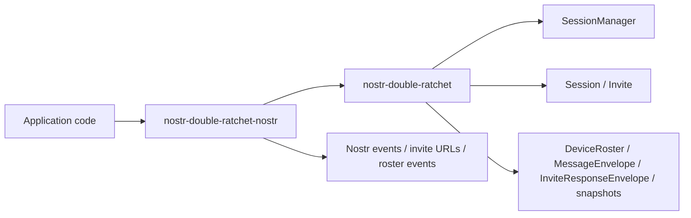
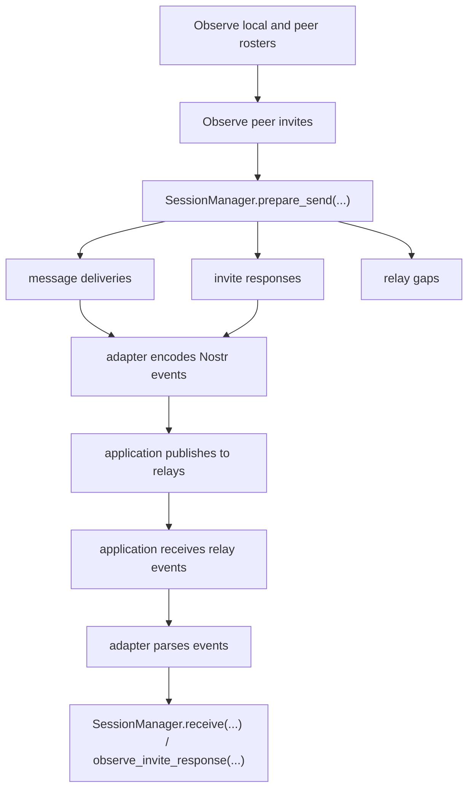

# nostr-double-ratchet

Hard-forked Double Ratchet primitives for new applications.

The Rust side is now split into:

- `nostr-double-ratchet`: minimal synchronous domain core
- `nostr-double-ratchet-nostr`: Nostr event and invite adapter

## Rust Shape

The core crate keeps only:

- `Session`: low-level device-to-device ratchet
- `Invite`: low-level bootstrap primitive
- `SessionManager`: the only high-level multi-device API
- typed ids, rosters, snapshots, explicit errors, and `ProtocolContext`

The core does not expose:

- `NdrState`
- `PeerBook`
- `AppKeys`
- `Rumor`
- `DirectMessageContent`
- group state
- Nostr event or invite URL codecs

`SessionManager` is the supported application API. `Session` and `Invite` stay public for direct
device-to-device integrations.

## Architecture

The current fork is intentionally split into a pure domain layer and a Nostr adapter layer.



The core crate has no relay runtime, storage abstraction, background workers, or FFI surface.
Apps own transport, persistence, and scheduling.

## Typical Use



## Repository Layout

- `rust/crates/nostr-double-ratchet/`: domain core
- `rust/crates/nostr-double-ratchet-nostr/`: Nostr adapter
- `ts/`: TypeScript implementation
- `formal/`: protocol models

## Development

```bash
cargo test --manifest-path rust/Cargo.toml
cargo clippy --manifest-path rust/Cargo.toml --workspace --tests -- -D warnings
pnpm -C ts test:once
```

## Notes

- Core payloads are opaque `Vec<u8>`.
- Device authorization in the core is modeled as `DeviceRoster`.
- Nostr event kinds, URL formats, and roster-event translation live only in the adapter crate.
- State transitions are synchronous and explicit. No runtime, pubsub, storage layer, or background
  workers are built into the core.

See [rust/README.md](./rust/README.md) for the Rust workspace overview.
