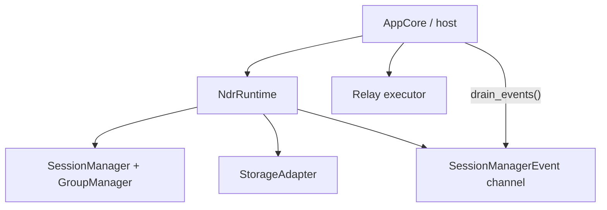
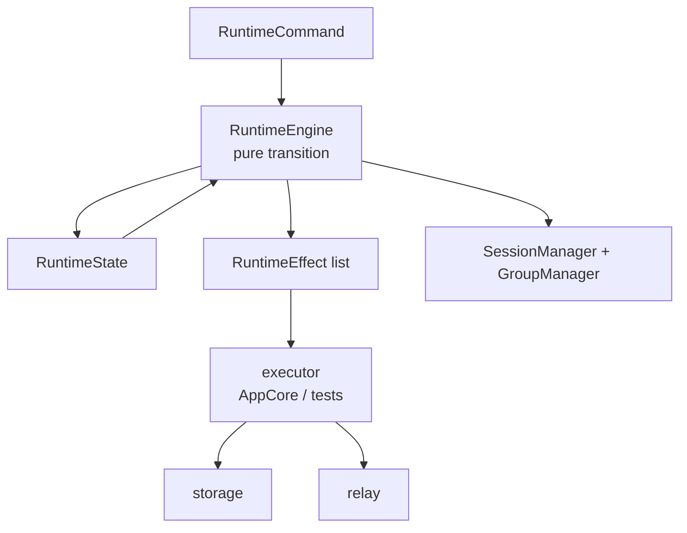
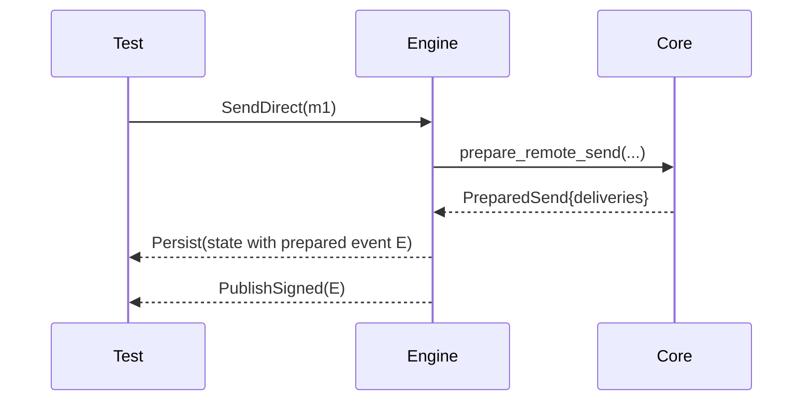

# Runtime Testability Improvements

This branch explores whether the current feature-complete runtime can move closer
to the minimalist `experimental-chat` philosophy without losing parity. The
specific goal is not style cleanup. The goal is to make race conditions, sudden
halts, relay failures, and persistence boundaries testable as deterministic
state-machine behavior.

## Problem

The current core crate is already small and synchronous. The remaining
testability risk is the runtime layer:



This works, but it hides correctness across several mechanisms:

- runtime mutation
- storage side effects
- an internal event channel
- app-side channel draining
- relay publish acknowledgements
- app persistence and UI projection

That makes crash and race tests harder than they need to be. A test cannot simply
ask, "given this state and this input, what must happen next?" It has to also
model whether the event channel was drained, whether AppCore published, and
whether the runtime persisted before or after the emitted event.

## Target Shape

Introduce a deterministic runtime engine underneath the existing `NdrRuntime`
facade.



The engine should not perform relay IO, sleep, spawn, subscribe, publish, write
storage, or emit UI events directly. It should synchronously transform state and
return effects.

Sketch:

```rust
pub struct RuntimeTransition {
    pub state: RuntimeState,
    pub effects: Vec<RuntimeEffect>,
}

pub enum RuntimeCommand {
    Restore,
    SendDirect {
        peer: OwnerPubkey,
        payload: Vec<u8>,
        client_message_id: String,
    },
    SendGroup {
        group_id: String,
        payload: Vec<u8>,
        client_message_id: String,
    },
    ObserveProtocolEvent(ParsedProtocolEvent),
    ObserveMessageEvent(ParsedMessageEvent),
    PublishAck {
        event_id: String,
    },
    DeliveryAck {
        inbox_id: String,
    },
    TimerFired {
        timer_id: TimerId,
    },
}

pub enum RuntimeEffect {
    Persist(RuntimeState),
    PublishSigned(SignedProtocolEvent),
    Subscribe {
        id: String,
        filter: ProtocolFilter,
    },
    Unsubscribe {
        id: String,
    },
    FetchBackfill {
        filters: Vec<ProtocolFilter>,
    },
    EmitDecrypted {
        inbox_id: String,
    },
    ScheduleTimer {
        timer_id: TimerId,
        at_ms: u64,
    },
}
```

The existing `NdrRuntime` can remain as a compatibility facade while it delegates
to this engine and executes effects.

## Exact Hard Test 1: Prepared Direct Send Crash Matrix

This is the first test the new shape should make easy.

Setup:

- Alice has a restored runtime state.
- Bob's roster and device invite are already known.
- Alice and Bob already have an active sendable pairwise session.
- Alice sends one direct payload with `client_message_id = "m1"`.

Expected first transition:



Required ordering:

1. The ratchet-advanced core snapshot and exact signed event `E` must be
   persisted before `PublishSigned(E)` is executed.
2. If the process halts after persistence but before publish, restore must replay
   the same `E`.
3. If the process halts after publish but before relay ack, restore must replay
   the same `E`.
4. Replaying a prepared publish must never call `prepare_remote_send` again.
5. After `PublishAck(E.id)` is durably applied, restore must not replay `E`.

Crash points to test:

| Crash point | Restored behavior |
| --- | --- |
| Before `Persist(state with E)` | No durable ratchet advance. The app may resubmit `m1`; runtime idempotency decides whether to prepare once or reject duplicate intent. |
| After `Persist(state with E)`, before `PublishSigned(E)` | `Restore` emits `PublishSigned(E)`. |
| After `PublishSigned(E)`, before `PublishAck(E.id)` | `Restore` emits `PublishSigned(E)` again. Duplicate relay publish is acceptable because the event id is identical. |
| After `PublishAck(E.id)`, before ack persistence | `Restore` may emit `PublishSigned(E)` again. This is acceptable and idempotent. |
| After ack persistence | `Restore` emits no publish for `E`. |

Assertions:

- `E.id` is stable across every replay.
- The restored core snapshot is byte-identical after prepared-publish replay.
- There is no second ratchet advancement for `m1`.
- Bob receives at most one app-visible message after duplicate relay delivery.
- The pending prepared-publish store never contains two entries with the same
  event id.

## Exact Hard Test 2: Inbound Decrypt Crash Matrix

Setup:

- Alice receives one valid encrypted pairwise message event `E`.
- Decrypting `E` advances Alice's receiving ratchet state.

Required ordering:

1. Runtime decrypts through core.
2. Runtime persists the advanced core snapshot and a durable decrypted inbox
   record.
3. Only after that persistence does it emit `EmitDecrypted(inbox_id)`.

Crash points to test:

| Crash point | Restored behavior |
| --- | --- |
| Before decrypt persistence | Relay replay of `E` decrypts from old state and creates one inbox record. |
| After decrypt persistence, before `EmitDecrypted` | `Restore` emits the pending inbox record. |
| After `EmitDecrypted`, before `DeliveryAck(inbox_id)` persistence | `Restore` may emit the same inbox record again. App projection dedupes by `inbox_id`. |
| After delivery ack persistence | `Restore` does not emit the inbox record again. |

Assertions:

- Ratchet state is not advanced without a durable inbox record.
- A decrypted message is never app-visible unless the advanced ratchet state is
  durable.
- Duplicate relay delivery of `E` never creates two app-visible messages.

## Exact Hard Test 3: Sender-Key Distribution Gap

Setup:

- Alice, Bob, and Charlie are in a sender-key group.
- Charlie receives a public group outer event before the pairwise sender-key
  distribution that maps `sender_event_pubkey` to an authenticated sender.

Required behavior:

1. The unknown outer event is persisted as pending.
2. Runtime plans subscription/backfill for the missing sender-key distribution.
3. When distribution arrives, runtime persists the sender-key record and retries
   the pending outer.
4. Decrypting the pending outer follows the inbound decrypt ordering above.

Assertions:

- The outer event is not trusted before authenticated pairwise distribution.
- The inner rumor `pubkey` does not affect sender identity.
- Restart between distribution persistence and pending-outer retry still
  decrypts exactly once.
- Removed or unauthorized members cannot become valid senders by publishing a
  matching public outer event.

## Fuzzing Strategy

Start with model-based property tests in Rust. Do not start with mobile fuzzing.
The useful fuzz target is the runtime engine state machine.

Command alphabet:

- `Restore`
- `SendDirect`
- `SendGroup`
- `ObserveAppKeys`
- `ObserveInvite`
- `ObserveInviteResponse`
- `ObservePairwiseMessage`
- `ObserveGroupOuter`
- `ObserveSenderKeyDistribution`
- `PublishAck`
- `DeliveryAck`
- `TimerFired`
- duplicate any previous observed event
- restart after any prefix of effects

Generated environment choices:

- one owner with one device
- one owner with two linked devices
- two owners with delayed AppKeys
- two owners with delayed device invite
- three-owner sender-key group
- revoked linked device
- removed group member
- public relay duplicate/reorder behavior

Core invariants:

- Prepared publish replay never advances a ratchet.
- Every `PublishSigned` for a prepared event is preceded by a durable state that
  contains that event.
- Every app-visible decrypt is preceded by durable advanced receive state plus a
  durable inbox record.
- Duplicate relay events do not produce duplicate app-visible messages.
- Missing `RelayGap` prerequisites produce durable pending intent plus
  subscription/backfill effects.
- Subscription effects are a pure function of known owners, pending gaps, known
  invite response pubkeys, and known group sender-event pubkeys.
- Group outer messages are only accepted after authenticated sender-key
  distribution.
- Group metadata snapshots are accepted only from authorized admins.
- Revoked devices and removed group members cannot create accepted sends after
  the relevant snapshot is observed.
- Plaintext `pubkey` and plaintext recipient tags never drive runtime routing.

Recommended first dependency is `proptest` in the runtime crate. `cargo-fuzz`
can come later for codec parsers and binary envelope parsing, but the first
correctness win is generated command sequences over the engine.

## Phased Implementation

1. Add `RuntimeCommand`, `RuntimeEffect`, and `RuntimeTransition` types behind
   the current facade.
2. Implement `Restore` and prepared-publish replay through the engine.
3. Move direct send preparation into the engine and keep the facade executing
   effects.
4. Add the prepared direct send crash matrix.
5. Move inbound decrypt into the engine and add the inbound decrypt crash matrix.
6. Move sender-key pending outer retry into the engine and add the distribution
   gap crash matrix.
7. Add model-based generated command tests with a small two-owner model.
8. Expand generation to linked devices and sender-key groups.

## Non-Goals

- Do not move relay IO into core.
- Do not make mobile tests responsible for exhaustive protocol race coverage.
- Do not change the current TS-compatible group wire format as part of this work.
- Do not remove the `NdrRuntime` facade until the engine has equivalent test
  coverage and app integration.
