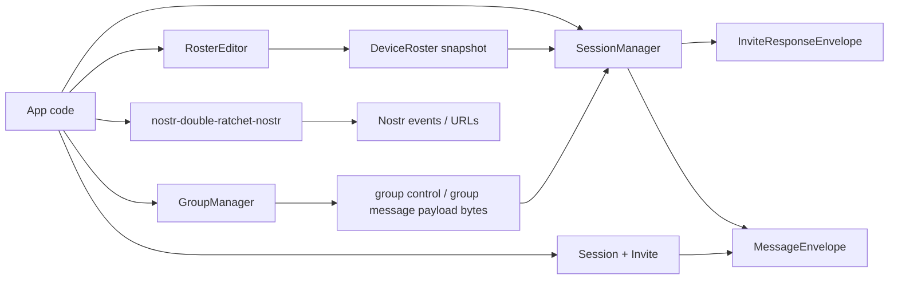
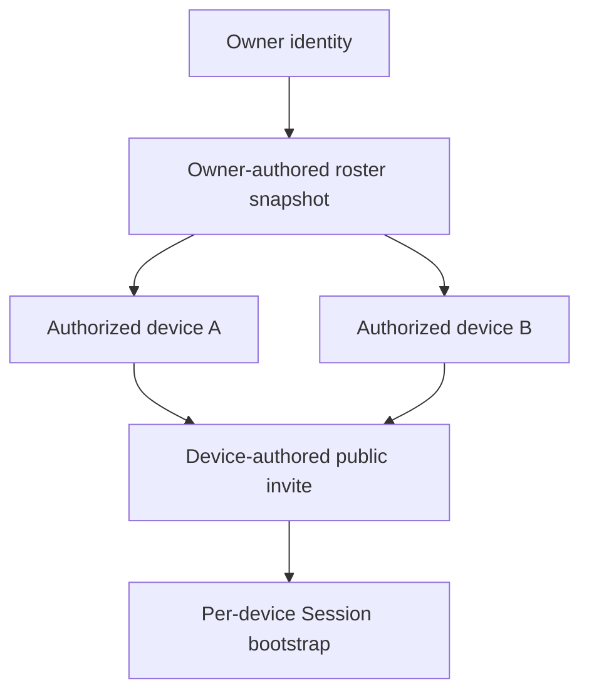
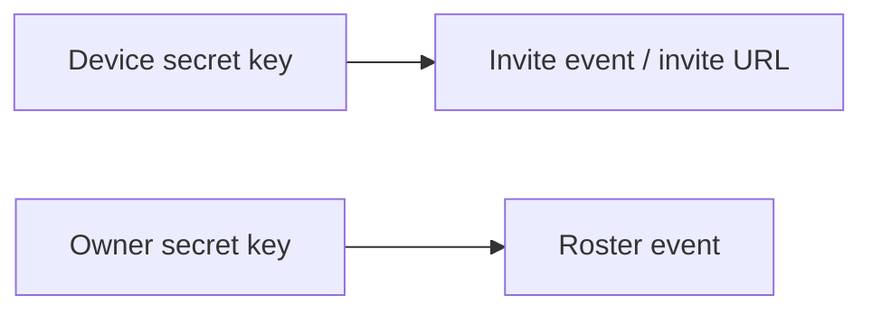
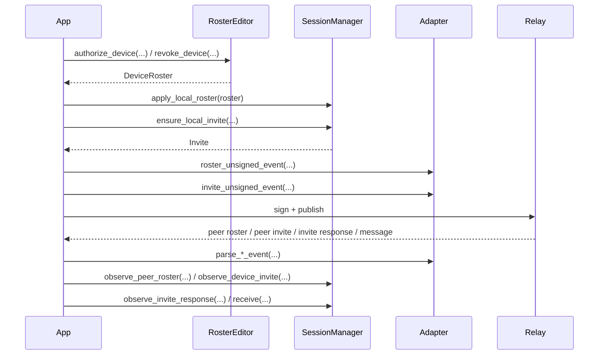
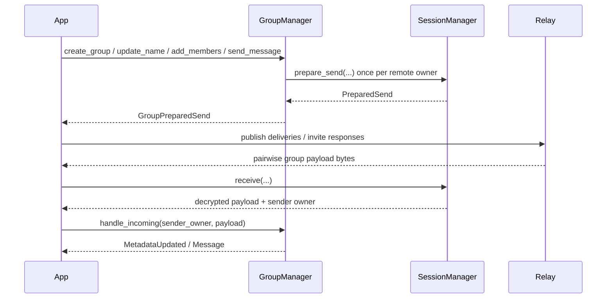
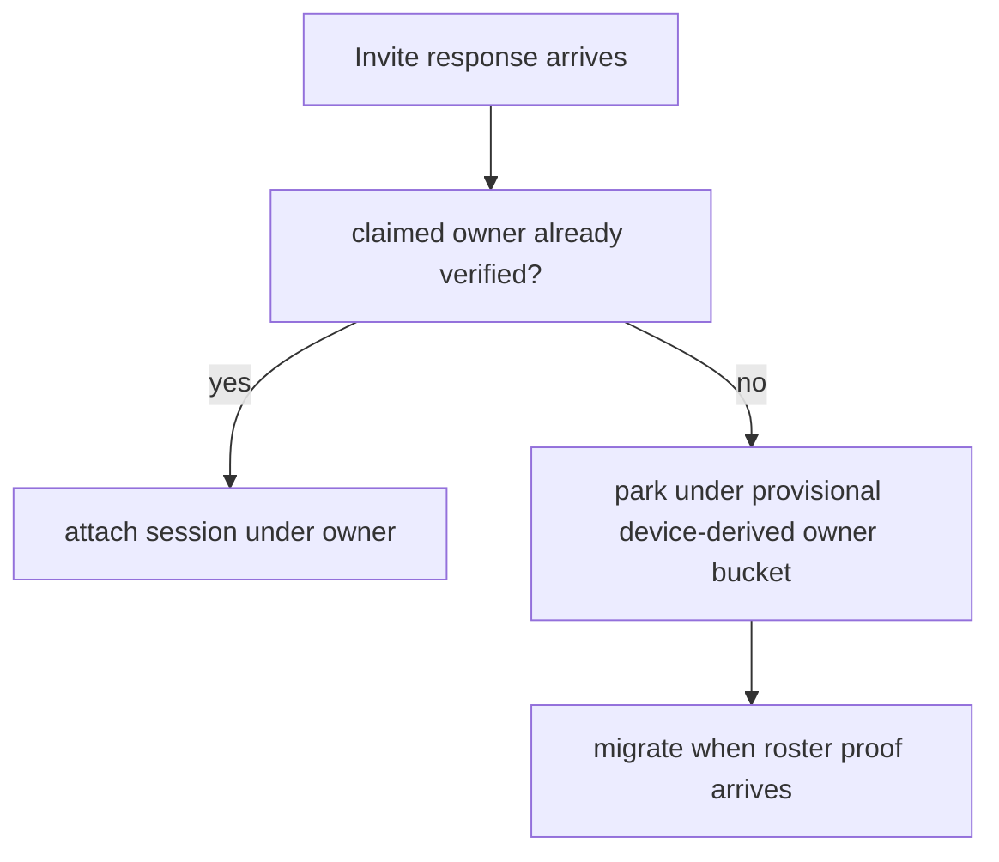

# Owner / Device Architecture

This document describes the current Rust architecture after the hard cut away from the old
`owner == device` convenience model.

For a user-facing integration guide, start with [./TUTORIAL.md](./TUTORIAL.md).

## Hard-Cut Summary

- `DevicePubkey::as_owner()` is gone.
- `OwnerPubkey::as_device()` is gone.
- `Invite` is now explicitly device-authored.
- `Invite` carries an optional owner claim instead of pretending the device key is the owner key.
- `SessionManager` always creates invites from the local device pubkey and always includes the
  local owner claim.
- `RosterEditor` stays separate from `SessionManager` and remains the supported roster-CRUD helper.
- `GroupManager` now sits above `SessionManager` for pairwise-fanout group metadata and chat.

## Topology



## Identity Roles



Rules:

- `Session` and `Invite` are direct device-to-device primitives.
- `SessionManager` is the owner/device orchestration layer.
- `GroupManager` is a separate group-state layer above `SessionManager`.
- When using `SessionManager`, always generate a separate local device key, even if the roster has
  only one device.

## Current Event Authority Split



This is intentional in the current adapter:

- invite publication is device-authored because the invite belongs to one device
- roster publication remains owner-authored because the roster event is the authoritative
  owner-level replaceable snapshot

That keeps roster replacement semantics stable without requiring multiple devices to co-author the
same replaceable record.

## Core Data Shapes

```rust
pub struct Invite {
    pub inviter_device_pubkey: DevicePubkey,
    pub inviter_ephemeral_public_key: DevicePubkey,
    pub shared_secret: [u8; 32],
    pub inviter_ephemeral_private_key: Option<[u8; 32]>,
    pub max_uses: Option<usize>,
    pub used_by: Vec<DevicePubkey>,
    pub created_at: UnixSeconds,
    pub inviter_owner_pubkey: Option<OwnerPubkey>,
}
```

```rust
pub struct SessionManagerSnapshot {
    pub local_owner_pubkey: OwnerPubkey,
    pub local_device_pubkey: DevicePubkey,
    pub local_invite: Option<Invite>,
    pub users: Vec<UserRecordSnapshot>,
}
```

```rust
pub struct PreparedSend {
    pub recipient_owner: OwnerPubkey,
    pub payload: Vec<u8>,
    pub deliveries: Vec<Delivery>,
    pub invite_responses: Vec<InviteResponseEnvelope>,
    pub relay_gaps: Vec<RelayGap>,
}
```

## SessionManager Flow



## GroupManager Flow



Current v1 group rules:

- group membership is in owner pubkeys
- group control is revision-based
- admins are enforced in the core crate
- v1 uses pairwise fanout, not a separate group ratchet or epoch key

## How To Use It

### 1. SessionManager path

```rust
use nostr_double_ratchet::{
    DevicePubkey, OwnerPubkey, ProtocolContext, RosterEditor, SessionManager, UnixSeconds,
};

let owner_pubkey: OwnerPubkey = /* account identity */;
let local_device_secret_key: [u8; 32] = /* installation key */;
let local_device_pubkey = DevicePubkey::from_secret_bytes(local_device_secret_key)?;

let mut roster_editor = RosterEditor::new();
roster_editor.authorize_device(local_device_pubkey, UnixSeconds(1_850_000_000));
let local_roster = roster_editor.build(UnixSeconds(1_850_000_001));

let mut manager = SessionManager::new(owner_pubkey, local_device_secret_key);
manager.apply_local_roster(local_roster);

let mut ctx = ProtocolContext::new(UnixSeconds(1_850_000_002), &mut rng);
let local_invite = manager.ensure_local_invite(&mut ctx)?.clone();
```

Then:

1. encode and publish the owner-authored roster event
2. encode and publish the device-authored invite event
3. observe peer rosters and peer invites
4. call `prepare_send(...)`
5. publish `deliveries` and `invite_responses`
6. feed inbound invite responses and message envelopes back to the manager

### 2. Direct device-to-device path

```rust
use nostr_double_ratchet::{Invite, ProtocolContext, Session, UnixSeconds};

let mut invite_ctx = ProtocolContext::new(UnixSeconds(1_850_000_010), &mut rng);
let invite = Invite::create_new(&mut invite_ctx, alice_device_pubkey, None, None)?;

let mut accept_ctx = ProtocolContext::new(UnixSeconds(1_850_000_011), &mut rng);
let (bob_session, response_envelope) =
    invite.accept(&mut accept_ctx, bob_device_pubkey, bob_device_secret_key)?;
```

This path does not need `SessionManager`, `DeviceRoster`, or an owner claim.

## Internal Review Notes



Current verification staging:

- unverified owner claims are parked under a provisional owner bucket derived from the device
  pubkey bytes
- once a roster proves that device belongs to the claimed owner, the record is migrated

That mechanism is not a public API shim. It is the current internal way to stage unverified owner
claims until roster proof arrives.

## Remaining Constraint

The main unresolved architectural constraint is unchanged:

- roster events are still modeled as owner-authored replaceable snapshots

If the project later wants secondary devices to publish authoritative roster updates without access
to the owner signing key, that will require a larger event-authority redesign rather than another
cleanup pass.
