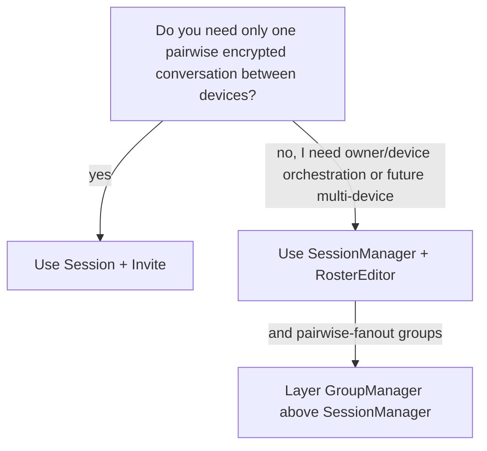
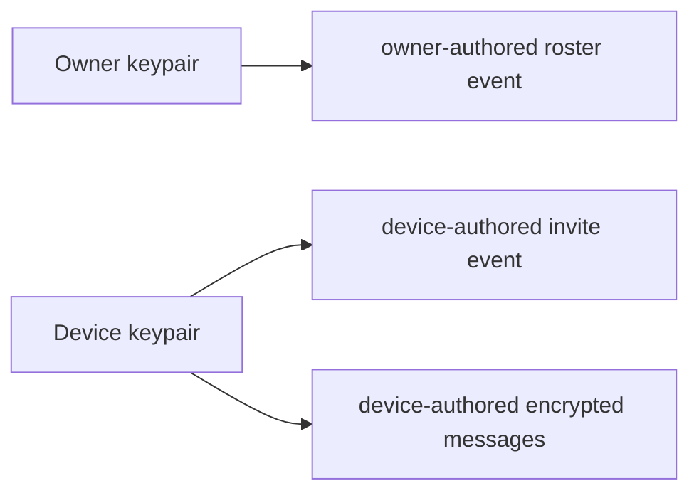
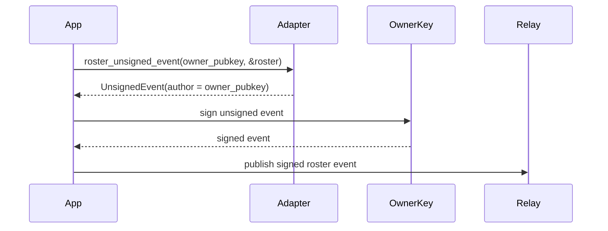
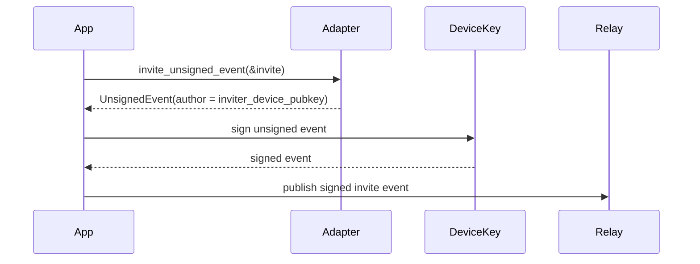
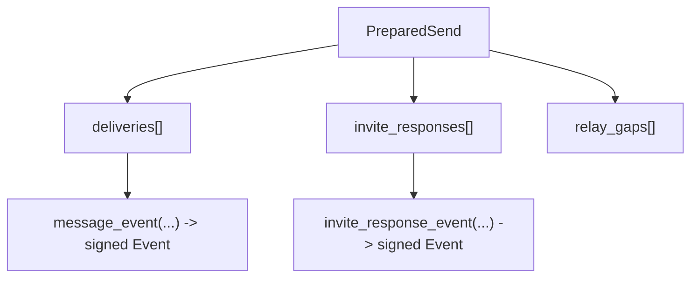
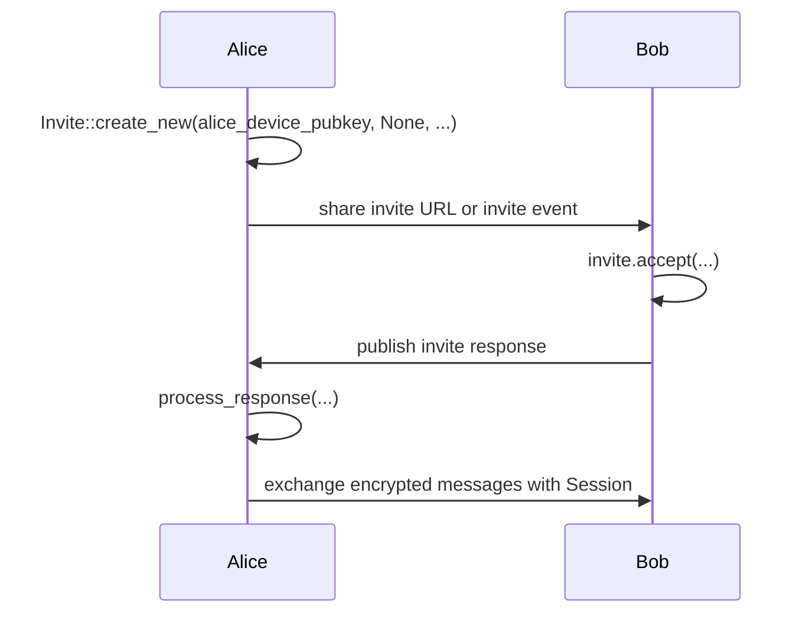
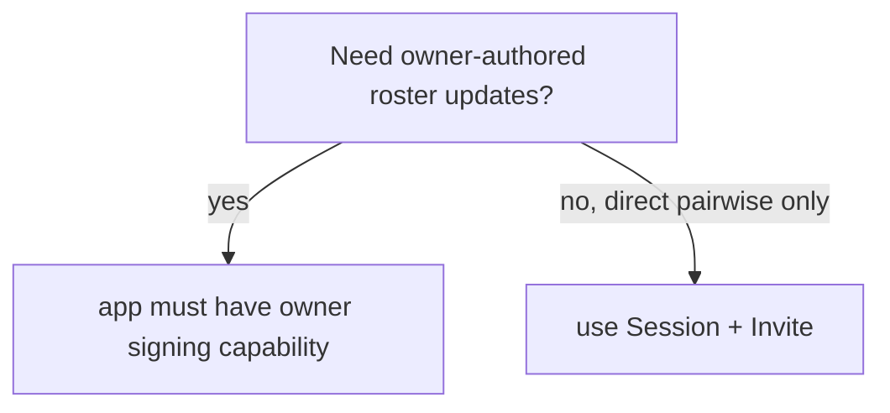

# Tutorial

This tutorial is for application developers integrating the Rust library.

It answers four practical questions:

1. Which API should I use?
2. Which keys do I need?
3. Which events do I sign with which key?
4. What is the end-to-end flow for direct chat vs `SessionManager`?

## Choose Your Mode



- Use `Session` + `Invite` for direct device-to-device encryption.
- Use `SessionManager` when your product has:
  - one owner identity
  - one or more authorized devices
  - a roster of those devices
- Use `GroupManager` above `SessionManager` when you want group membership and admin semantics but
  still want to transport everything over the existing pairwise session layer.

If you choose `SessionManager`, always create a separate device key even if the roster has only one device.

## The Key Model



Current rule:

- the roster is signed by the owner key
- invites are signed by the device key
- encrypted messages and invite responses are signed by device-side sender keys

This is the current contract of the adapter layer.

## What The Library Does And Does Not Do

The core crate does:

- manage ratchet state
- manage owner/device records in `SessionManager`
- manage pairwise-fanout group state in `GroupManager`
- build roster snapshots with `RosterEditor`
- produce `MessageEnvelope`, `Invite`, and `InviteResponseEnvelope`

The core crate does not:

- fetch from relays
- publish to relays
- persist your owner secret
- decide your UI flow
- define Nostr event kinds for group payloads in this pass

The Nostr adapter crate does:

- translate `Invite` / `DeviceRoster` / `MessageEnvelope` / `InviteResponseEnvelope` to and from Nostr artifacts

The Nostr adapter crate does not:

- publish automatically
- store keys
- run a relay client

## The Important Adapter Functions

These are the main boundary functions:

```rust
pub fn roster_unsigned_event(
    owner_pubkey: OwnerPubkey,
    roster: &DeviceRoster,
) -> Result<UnsignedEvent>

pub fn invite_unsigned_event(invite: &Invite) -> Result<UnsignedEvent>

pub fn message_event(envelope: &MessageEnvelope) -> Result<Event>

pub fn invite_response_event(envelope: &InviteResponseEnvelope) -> Result<Event>
```

Meaning:

- roster events come out unsigned, because your app must sign them with the owner key
- invite events come out unsigned, because your app must sign them with the device key
- message and invite-response events come out already signed, because the envelopes already contain the sender signing secret needed for that artifact

## SessionManager Tutorial

### Step 1: Create the owner and device identities

```rust
use nostr_double_ratchet::{DevicePubkey, OwnerPubkey, SessionManager};

let owner_pubkey: OwnerPubkey = /* your account identity */;
let local_device_secret_key: [u8; 32] = /* device installation secret */;
let local_device_pubkey = DevicePubkey::from_secret_bytes(local_device_secret_key)?;

let mut manager = SessionManager::new(owner_pubkey, local_device_secret_key);
```

### Step 2: Build the local roster

```rust
use nostr_double_ratchet::{RosterEditor, UnixSeconds};

let mut editor = RosterEditor::new();
editor.authorize_device(local_device_pubkey, UnixSeconds(1_850_000_000));
let local_roster = editor.build(UnixSeconds(1_850_000_001));

manager.apply_local_roster(local_roster.clone());
```

### Step 3: Encode, sign, and publish the roster event



Code:

```rust
use nostr::{Keys, SecretKey};
use nostr_double_ratchet_nostr::nostr::roster_unsigned_event;

let owner_secret_key: [u8; 32] = /* your owner/account signing key */;
let owner_keys = Keys::new(SecretKey::from_slice(&owner_secret_key)?);

let unsigned_roster = roster_unsigned_event(owner_pubkey, &local_roster)?;
let signed_roster = unsigned_roster.sign_with_keys(&owner_keys)?;

// publish `signed_roster` with your relay client
```

This is the part that often causes confusion:

- `SessionManager` knows the owner pubkey
- but it does not hold the owner secret key
- so your application must sign the roster event itself

### Step 4: Create the local invite

```rust
use nostr_double_ratchet::{ProtocolContext, UnixSeconds};

let mut ctx = ProtocolContext::new(UnixSeconds(1_850_000_002), &mut rng);
let invite = manager.ensure_local_invite(&mut ctx)?.clone();
```

This invite is device-authored and includes the local owner claim.

### Step 5: Encode, sign, and publish the invite event



Code:

```rust
use nostr::{Keys, SecretKey};
use nostr_double_ratchet_nostr::nostr::invite_unsigned_event;

let device_keys = Keys::new(SecretKey::from_slice(&local_device_secret_key)?);

let unsigned_invite = invite_unsigned_event(&invite)?;
let signed_invite = unsigned_invite.sign_with_keys(&device_keys)?;

// publish `signed_invite`
```

You can also expose the invite as an out-of-band URL instead of a relay event.

### Step 6: Observe peer roster and peer invite

When a peer roster event arrives:

```rust
use nostr_double_ratchet_nostr::nostr::parse_roster_event;

let decoded = parse_roster_event(&event)?;
manager.observe_peer_roster(decoded.owner_pubkey, decoded.roster);
```

When a peer invite arrives:

```rust
use nostr_double_ratchet_nostr::nostr::parse_invite_event;

let invite = parse_invite_event(&event)?;
let owner_pubkey = invite
    .inviter_owner_pubkey
    .ok_or_else(|| anyhow!("peer invite missing owner claim"))?;

manager.observe_device_invite(owner_pubkey, invite)?;
```

### Step 7: Prepare a send

```rust
let prepared = manager.prepare_send(&mut ctx, recipient_owner_pubkey, b"hello".to_vec())?;
```

This gives you:

- `deliveries`: encrypted message envelopes to publish
- `invite_responses`: bootstrap responses to publish
- `relay_gaps`: missing roster or missing invite conditions

### Step 8: Publish the prepared artifacts



Code:

```rust
use nostr_double_ratchet_nostr::nostr::{invite_response_event, message_event};

for delivery in &prepared.deliveries {
    let event = message_event(&delivery.envelope)?;
    // publish event
}

for response in &prepared.invite_responses {
    let event = invite_response_event(response)?;
    // publish event
}
```

Notice the difference from roster/invite publication:

- `message_event(...)` signs for you from the envelope
- `invite_response_event(...)` signs for you from the envelope
- `roster_unsigned_event(...)` and `invite_unsigned_event(...)` do not

### Step 9: Consume incoming invite responses and messages

```rust
use nostr_double_ratchet_nostr::nostr::{
    parse_invite_response_event, parse_message_event,
};

let incoming_response = parse_invite_response_event(&event)?;
manager.observe_invite_response(&mut ctx, &incoming_response)?;

let incoming_message = parse_message_event(&event)?;
manager.receive(&mut ctx, sender_owner_pubkey, &incoming_message)?;
```

## Direct Device-to-Device Tutorial

Use this path when you do not want owner/device orchestration.



Code:

```rust
use nostr_double_ratchet::{Invite, ProtocolContext, Session, UnixSeconds};

let mut invite_ctx = ProtocolContext::new(UnixSeconds(1_850_000_010), &mut rng);
let mut invite = Invite::create_new(&mut invite_ctx, alice_device_pubkey, None, None)?;

let public_invite = invite.clone(); // or encode as URL / event

let mut accept_ctx = ProtocolContext::new(UnixSeconds(1_850_000_011), &mut rng);
let (bob_session, response_envelope) =
    public_invite.accept(&mut accept_ctx, bob_device_pubkey, bob_device_secret_key)?;

let alice_response = invite.process_response(&mut accept_ctx, &response_envelope, alice_device_secret_key)?;
let alice_session = alice_response.session;
```

This path uses:

- no roster
- no owner secret
- no `SessionManager`

## Common Mistakes

### “Why can’t SessionManager publish the roster by itself?”

Because the roster is owner-authored and `SessionManager` only stores:

- the owner pubkey
- the local device secret key

It does not store the owner secret key.

### “Why is the invite device-authored but the roster owner-authored?”

Because they represent different authority levels:

- invite = one device offering bootstrap
- roster = authoritative owner-level device list

### “Can I use SessionManager with only a device key?”

Not fully, not with the current adapter contract.

You can:

- create the local invite
- send and receive device-authored message artifacts

But you cannot publish the authoritative roster event unless your app also has access to the owner signing key.

## Current Constraint



That is the intended design today.
